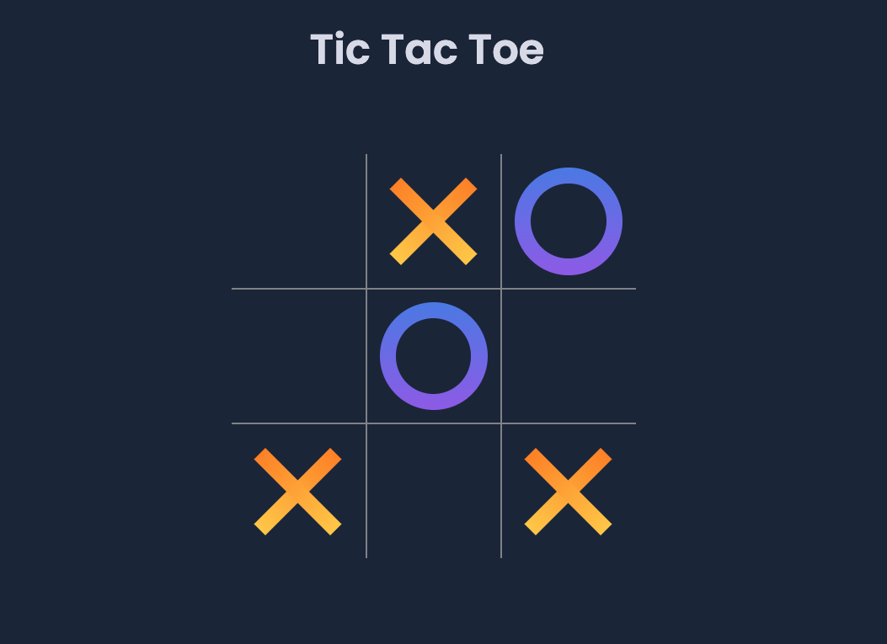

 
<!-- Title Description -->
# Tic-Tac-Toe-JavaScript
A simple online Tic Tac Toe game written with Vanilla JavaScript, HTML &amp; CSS

 
 
<!-- Technologies used -->

 
<h2 align="left">🛠 Languages and Tools:</h2>
 

 

 
 <!-- Screenshot -->
   

 
 

   <!-- Online link -->
   
 
<h2 align="left">👀 View online:</h2>
 
<a href="https://deftpegtictactoejs.netlify.app/" target="_blank" rel="noreferrer">
Take me to the website, </a>
or alternately, click on the image 👉

